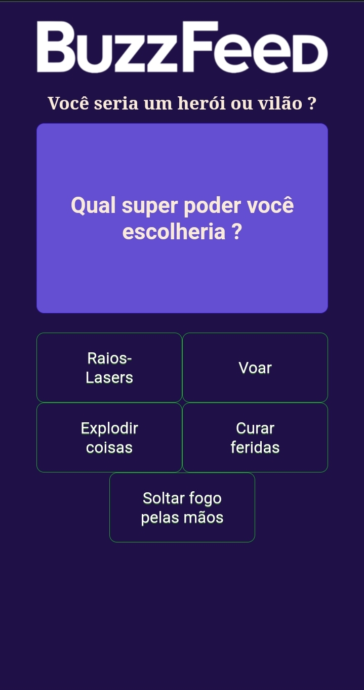

# 🚀 Buzzfeed Clone Angular

Esse projeto foi realizado durante o bootcamp Desenvolvimento Frontend com Angular, da DIO.

## 🚀 Preview

## 🚀 Sobre o projeto

O projeto é um teste de perguntas e respostas baseado nos testes do Buzzfeed, um site de entretenimento e notícias.

## 🚀 Ferramentas utilizadas

O projeto foi feito utilizando o framework Angular e sua [CLI](https://github.com/angular/angular-cli) na versão 17.0.9.